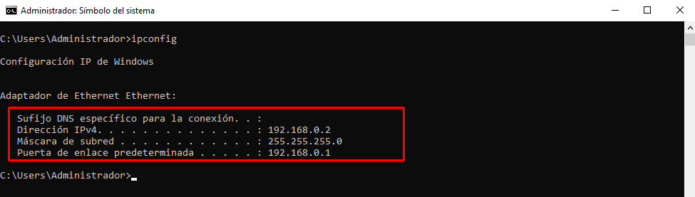
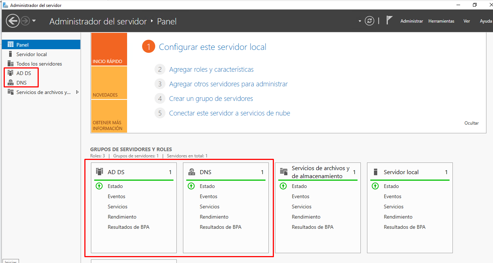
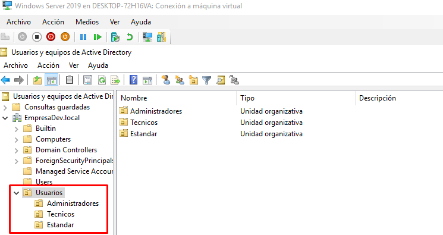
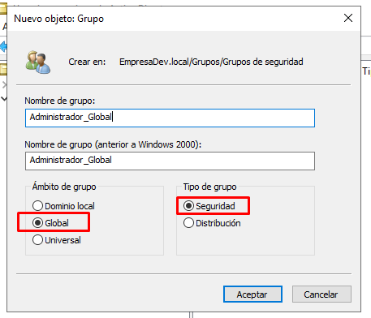
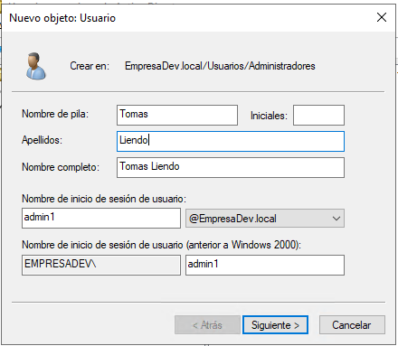
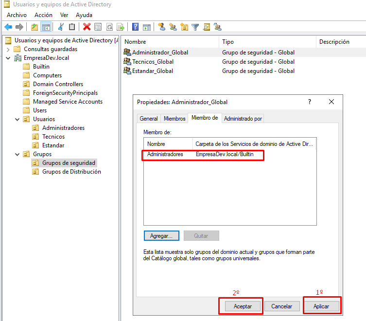
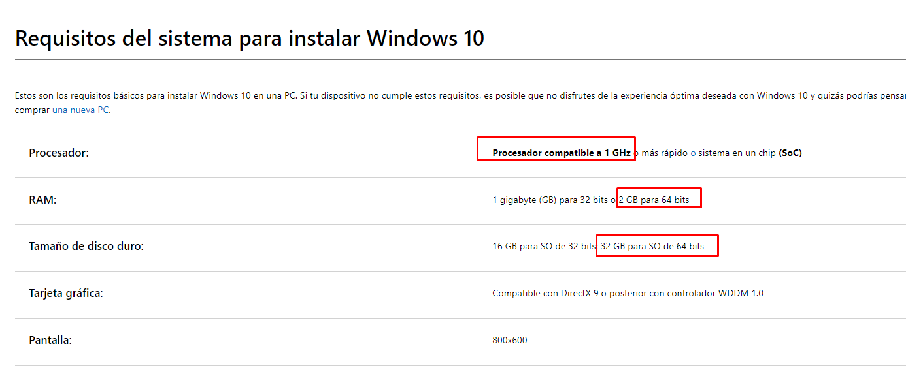
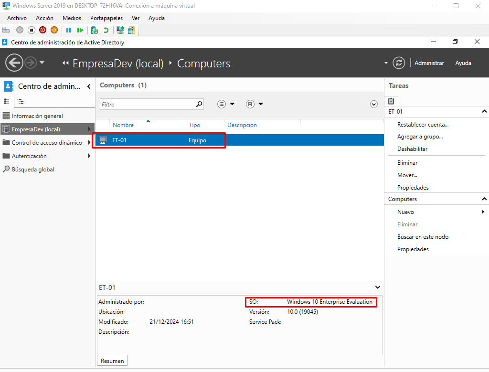

# Tarea 1: Configuración Inicial de una Infraestructura Básica

## Enunciado 1:

**Crear una máquina virtual (VM): Utilizando el virtualizador de tu preferencia (VirtualBox, VMware, Hyper-V, etc.), instala Windows Server 2019.**

## Procedimiento 1:

### Creación de la Máquina Virtual en Hyper-V

Se crea la siguiente máquina virtual empleando el virtualizador **Hyper-V** obteniendo como resumen los siguientes aspectos:

---

### Requisitos del Sistema

Para los requisitos de la **memoria RAM**, **almacenamiento**, etc., me basé en las especificaciones publicadas en la página de Microsoft:

---

### Configuración de Red

La configuración del **adaptador de red** se encuentra en **LAN (Red privada)**, como se puede observar en la siguiente imagen:

---

### Elección de la Experiencia de Escritorio

Se elige la **experiencia de escritorio** para una mayor facilidad:

---

### Creación de Servidor

Como creamos un **servidor desde 0**, elegimos la siguiente opción:

---

### Almacenamiento Designado

El almacenamiento designado es el siguiente:

---

### Credenciales

Teniendo en cuenta las siguientes credenciales:

- **Usuario**: administrador
- **Contraseña**: Tomy@dev10

---

## Enunciado 2:

**Configurar un Active Directory (AD):**

- **Promocionar el servidor a controlador de dominio.**
- **Crear un dominio, por ejemplo: empresa.local.**

## Procedimiento 2: Promoción del Servidor a Controlador de Dominio

### Pasos Previos para Promocionar el Servidor a Controlador de Dominio

#### 1. Configuración de Dirección IP Estática

Se configura una **dirección IP estática** para el servidor con el objetivo de que la misma no cambie de forma dinámica como estaba por defecto. Se configura como **servidor DNS** al mismo servidor, por lo que usamos la dirección IP previamente configurada: `192.168.0.2`.

---

#### 2. Instalación del Active Directory

Posteriormente, se procede a realizar la instalación del **Active Directory (AD)**:

---

#### 3. Selección de Características

En la ventana de **"Características"**, dejamos las opciones seleccionadas por defecto (Paso 4) y confirmamos la instalación (Paso 5). Luego llegamos al último paso (Paso 6), en la pestaña de **"Resultados"**, que veremos a continuación:

---

#### 4. Promoción del Servidor a Controlador de Dominio

Ahora, vamos a promover el servidor a **Controlador de Dominio** donde ingresamos el **nombre de dominio raíz**:

**Credenciales:**
- **Usuario**: administrador
- **Contraseña**: Tomy@dev10

---

#### 5. Advertencia por Falta de Servidor DNS

Todavía no se cuenta con un servidor **DNS** instalado (para la resolución de nombres de dominios a direcciones IP), pero se instalará más adelante. Por esta razón, nos aparece la siguiente advertencia:

---

#### 6. Instalación del AD y DNS

Finalmente, podemos observar que se ha instalado el **Active Directory (AD)** y **DNS** con sus consolas correspondientes, ya que estos van de la mano:

---

## Enunciado 3:

**Gestión de usuarios en el AD:**

- **Usuario Administrador:** Permisos de administración total sobre el dominio.
- **Usuario Técnico:** Permisos limitados para gestionar recursos específicos (como crear grupos o modificar usuarios).
- **Usuario Estándar:** Permisos básicos de uso (inicio de sesión y acceso limitado).

## Procedimiento 3:

Primero creamos unidades organizativas con el objetivo de mantener una estructura más clara (usuarios organizados y categorizados) y permitir una mejor administración de políticas y permisos de subconjunto de usuarios.

Se crean las UO correspondientes, siguiendo la siguiente estructura:

- **EmpresaDev.local**
  - **Usuarios**
    - **Administradores**
    - **Técnicos**
    - **Estándar**

A continuación se crearon grupos de seguridad previamente creando Unidades Organizativas (UO), respetando la siguiente estructura actualizada:

- **EmpresaDev.local**
  - **Usuarios**
    - **Administradores**
    - **Técnicos**
    - **Estándar**
  - **Grupos**
  - **Grupos de Seguridad**
  - **Grupos de Distribución**

Se procede a crear los grupos correspondientes de seguridad:

Se elige el ámbito global ya que necesitamos gestionar recursos y usuarios dentro del mismo dominio. Donde los miembros tienen que ser del mismo dominio del cual se crea el grupo y los permisos del grupo pueden asignarse a recursos en cualquier dominio del bosque.

Además, son más eficientes en entornos con un solo dominio como se está planteando en dicho desafío.

En base a la lógica anterior, se crean los demás grupos de seguridad, obteniendo como resultado los 3 grupos de seguridad:

Ahora a continuación se crearán los usuarios en sus respectivas OU y asignando a cada uno al grupo de seguridad correspondiente.

Creación de usuario administrador

Para el caso de la Unidad Organizativa “Usuarios” y luego la Subunidad Organizativa “Administradores” se crea el siguiente usuario administrador:

**Usuario:** admin1  
**Contraseña:** Firefox@15

Con la opción marcada, el usuario administrador cuando intente loguearse por primera vez deberá escoger una contraseña en base a los requerimientos de seguridad definidos. De esta manera, la contraseña con la cual creamos a dicho usuario (la default) ya no tendrá vigencia y la que funcionará es la configurada por el propio administrador.

Resumen final:

Con la misma lógica explicada anteriormente se crean el usuario técnico 1 (Juan Liendo) y el usuario estándar 1 (Arturo Liendo).

**Usuario:** tecnico1  
**Contraseña:** Firefox@16  

**Usuario:** estandar1  
**Contraseña:** Firefox@17  

A continuación se procede a realizar la asignación de permisos a los grupos creados previamente y luego agregar a los usuarios al grupo correspondiente.

Asignación de permisos al usuario administrador

Para el caso del usuario administrador creado “admin1”, lo que se va a hacer es que el grupo “Administrador_Global” sea miembro de otro grupo: **“Administradores”**, por lo que va a heredar sus privilegios. Es decir, los administradores tendrán acceso completo y sin restricciones al equipo o dominio.

Basándonos en los siguientes pasos:

Encontramos dicho grupo al cual queremos formar parte con el grupo de “Administrador_Global”.

Por lo tanto, concluimos aplicando y aceptamos los cambios realizados para dicho grupo:

Chequeado nuevamente en dicho grupo “Administrador_Global” y seleccionando propiedades, se verifica lo anterior:

Sumar al usuario admin1

Ahora se va a sumar al usuario admin1, es decir, Tomás Liendo, como miembro del grupo “Administrador Global”.

Chequeado nuevamente en dicho grupo “Administrador_Global” y seleccionando propiedades, se verifica lo anterior:

Asignación de permisos al grupo Técnicos

Siguiendo la lógica anterior, agregamos los demás permisos y usuarios a los grupos siguientes.

Respecto a los permisos para el grupo **“Técnicos_Global”**, donde hay una gestión limitada del AD, es decir, el usuario **tecnico1** deberá tener permisos específicos, como crear grupos o modificar usuarios. Entonces:

Vamos a usar el Asistente de Delegación:

Seleccionamos el grupo correspondiente en cuestión: **“Técnicos_Global”**.

A continuación, seleccionamos las siguientes tareas que va a poder realizar dicho grupo **“Técnicos_Global”**:

Obteniendo como resultado:

Sumar al usuario tecnico1

Ahora se va a sumar al usuario **tecnico1**, es decir, Juan Liendo, como miembro del grupo **“Técnicos_Global”**.

Verificando en las propiedades del grupo **“Técnicos_Global”**:

Asignación de permisos al grupo Estándar

Por último, para el usuario estándar 1 (Arturo Liendo), lo que se va a hacer es que el grupo **“Estandar_Global”** sea miembro de otro grupo: **“Usuarios”**, por lo que va a heredar sus privilegios. Es decir, los usuarios estándares no podrán hacer cambios accidentales o intencionados en el sistema y pueden ejecutar la mayoría de aplicaciones.

Por lo tanto, llegamos al siguiente resultado:

## Enunciado 4:

**Crear y unir un workstation:**

- **Crear una nueva VM con Windows 10 o Windows 11 como estación de trabajo.**
- **Unir la estación de trabajo al dominio configurado en el AD.**

## Procedimiento 4:

La lógica para instalar Windows 10 en una máquina virtual (Hyper - V) es muy parecida a la ya explicada anteriormente, es decir, cuando instalamos Windows Server 2019. Por ende directamente veremos como quedó configurada:

Se le asignó 2GB de memoria RAM, 50 GB para almacenamiento y el adaptador de RED para LAN, es decir, configurada para una red privada. Lo cual podemos corroborar en la siguiente imagen donde se observa la administración de los conmutadores virtuales:

Las especificaciones fueron decididas en base a la documentación que indica la página oficial de Windows:

Unir la estación de trabajo al dominio configurado en el AD:

El usuario en cuestión para el S.O de Windows 10 es:

usuario: TomasL

pass: 123456

Primero vamos a chequear la dirección IP que tiene configurada (segmento de red al cual pertenece) la estación de trabajo:

Segundo chequeamos el Windows Server 2019 (servidor) la dirección IP que tiene configurada (segmento de red al cual pertenece):

Es decir, la estación de trabajo pertenece a otra red diferente a la cual tiene configurada nuestro servidor. Por lo tanto, debemos en primera instancia configurar dicha dirección IP y que la misma pertenezca al mismo segmento de red en cual se encuentra el servidor.

En el servidor antes vamos a abrir el centro de administración de Active Directory:

Luego chequeamos en el usuario administrador (cuenta principal) y observamos que dicha cuenta posee en “Miembros de” Usuarios de Dominio. Esto quiere decir, que el administrador forma parte del grupo de usuarios de dominio, lo cual le permite agregar clientes al dominio creado previamente. En la siguiente imagen se puede observar y aclarar lo explicado:

Ahora en base a lo explicado anteriormente se procede a configurar la estación de trabajo en Windows 10:

De esta manera le configuramos la dirección IPV4 privada 192.168.0.3/24 donde lo interesante a destacar aquí es que el servidor DNS que le vamos a configurar es la dirección IP del servidor (Windows Server 2019) porque dicho servidor es el que se va a encargar de dicho servicio. Es decir, de la resolución de nombres de dominio.

Ahora volvemos a chequear y ya está realizada la configuración de dicha dirección IP:

Ahora realizamos un ping a la dirección IP que tiene configurada el servidor desde la estación de trabajo y observamos que todos los paquetes fueron enviados sin ninguna pérdida. Como se puede observar en la siguiente imagen:

Ahora voy a cambiar el nombre de las estación de trabajo a uno que sea más fácil de recordar y que siga determinada nomenclatura para el futuro si quiero agregar nuevas estaciones.

También voy a modificar el nombre de dominio ¿Por cual? Por el que cree anteriormente. Por lo tanto:

Nombre del equipo: ET-01

Dominio: EmpresaDev.local

Observamos que nos pide para realizar dicha acción: el nombre y la contraseña de una cuenta que posea estos permisos para unir al dominio. Por lo tanto, aquí vamos a usar las credenciales del administrador (cuenta principal) :

usuario: administrador

pass: admin@dev10

Aquí vamos a retomar un momento al servidor (Windows Server 2019) y vamos a usar el usuario previamente creado en la sección anterior que pertenece al grupo “Adminstrador_Global” el cual posee los permisos de administración total sobre el dominio. Tener en cuenta que previamente en el servidor cuando nos iniciamos por primera vez nos va a pedir que actualicemos la contraseña porque así lo habiamos configurado entonces:

Credenciales anteriores:

usuario: admin1

pass: Firefox@15

Credenciales actuales:

usuario: admin1

pass: Firefox_15

Ahora si volvemos a la estación de trabajo y completamos con dicho usuario explicado anteriormente:

Luego de esperar unos momentos, aparece el siguiente cartel:

De esta manera la estación de trabajo ET-01 se ha unido correctamente al dominio EmpresaDev.local.

A continuación vamos a reiniciar la estación de trabajo y nos vamos a loguear con el usuario estándar conocido como “estándar 1” (Arturo Liendo) que pertenece all grupo “Estándar Global".Es decir, los usuarios estándares no podrán hacer cambios accidentales o intencionados en el sistema y pueden ejecutar la mayoría de aplicaciones.

Donde las credenciales son:

usuario: estandar1

pass: Firefox_17

Y ya nos reconoce el usuario del dominio creado anteriormente:

Si ingresamos \\\\192.168.0.2 (ip del servidor) podemos observar las siguientes carpetas compartidas que hacen parte del dominio:

Pero si quiero acceder a dichas carpetas tengo el acceso denegado como fue configurado dicho usuario con la menor cantidad de privilegios:

Desde el servidor podemos chequear que la estación de trabajo ya forma parte del dominio:

## Enunciado 5:

**Configurar y levantar un sitio web estático:**

- **Instalar y configurar IIS en el servidor.**
- **Crear un sitio web que muestre la página estática "Hola Mundo".**
- **Configurar el sitio para que sea accesible desde la LAN.**

## Procedimiento 5:

Para instalar IIS en el servidor, primero nos dirigimos a “Agregar roles y características”:

En la siguiente imagen veremos el paso a paso de cómo se realiza dicha configuración:

Una vez instalado el ISS en el panel de administración del servidor podemos ver que ya se encuentra dicho servicio con su consola correspondiente:

Ahora en la consola de IIS seleccionamos la siguiente opción:

Donde podemos observar que ya se encuentra un sitio web por default:

En base a que el servicio ISS ya se encuentra activo desde el servidor, como lo observamos en la imagen anterior. Lo que voy a realizar a continuación es: probar ingresar a dicho sitio web por default desde la estación de trabajo denominada “ET-01” (Windows 10) previamente configurada en el mismo segmento de red en el cual se encuentra el servidor empleando el navegador.

Como se puede observar, se pudo ingresar a dicho sitio web.

Para subir el archivo index.html se pueden realizar diversos procedimientos, en este caso, voy a plantear 2 situaciones:

En la primera situación: se va agregar un nuevo adaptador de red a la máquina virtual dónde está configurado el Windows Server 2019 del tipo WAN, es decir, una red externa para de esta manera permitir acceder a internet y descargar dicho archivo.

Con la siguiente URL se puede acceder al archivo index.html: <https://drive.google.com/drive/folders/1MtW7kZGbD7e1P-QzHH4tLICdTSm4UPNn?usp=sharing>

Por ende, desde el servidor vamos a acceder a dicha URL y descargar el contenido.

La segunda situación y la que voy a elegir por su simplicidad, es la de emplear Sesión Mejorada, chequeando previamente que se encuentre activida. Gracias a esto puedo arrastrar archivos entre el host y la máquina virtual empleada.

A continuación vamos a crear un nuevo sitio web:

Nos aparecerá la siguiente pantalla, donde ingresamos el nombre del sitio que será “prueba_tecnica” y la ruta donde vamos a alojar el archivo “index.html”

Nos aparecerá la siguiente advertencia que el puerto 80 ya está usado para el otro sitio web por default:

Por ende a continuación lo que se hace es detener dicho sitio web por default:

Y luego iniciar el sitio web “prueba_tecnica”:

Concluyendo, vamos a ingresar nuevamente desde la máquina virtual donde está instalado Windows 10 (estación de trabajo denominada ET-01) y obtenemos como resultado que el sitio web ha sido actualizado. Lo cual lo podemos observar en la siguiente imagen:

Si ingresamos directamente el dominio (que hemos creado previamente) en el navegador desde la misma estación de trabajo ¿Que pasa? Aparece también dicho sitio web ¿Por qué? Porque el servidor realiza la traducción o resolución del nombre de dominio de dirección IP.

