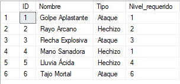
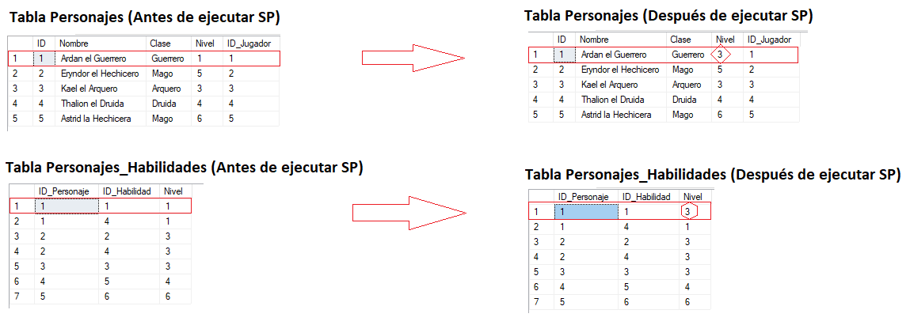

# Tarea 2: Configuración de SQL Server y Base de Datos

## Enunciado 1:

**Instalar SQL Server :** 

- Instalar y configurar SQL Server en la VM con Windows Server 2019.
- Habilitar el inicio de sesión con el usuario: sa.

## Procedimiento 1:

Primero descargo desde el sitio oficial de windows el motor de base de datos SQL Server Developer Edition 2022 el cual se adapta para realizar pruebas con Windows Server 2019.

LINK:

<https://www.microsoft.com/en-us/sql-server/sql-server-downloads>

Luego descargo también desde el sitio oficial de Windows el SQL Server Management Studio (SSMS) teniendo en cuenta que: es una herramienta gráfica que se utiliza para administrar instancias de SQL Server, ejecutar consultas y realizar tareas administrativas.

LINK: <https://learn.microsoft.com/es-es/sql/ssms/download-sql-server-management-studio-ssms?view=sql-server-ver16>

Realizadas las descargas anteriores desde la máquina anfitriona, se trasladan los archivos a la máquina virtual (Windows Server 2019) arrastrando dichos instaladores usando los beneficios que brinda la sesión mejorada.

A continuación se observa el proceso de instalación respecto al SQL server 2022:

****

Ahora se prosigue con la instalación del SQL Server Management Studio:

Una vez instalado accedemos al SQL Server Management Studio lo que voy a hacer a continuación es habilitar el inicio de sesión con el usuario “sa”. Por ende en primera instancia voy a emplear la Autenticación de Windows para conectarse a la BD:

Y observamos que por defecto tal usuario “sa” se encuentra inhabilitado:

Por ende se ingresa en las propiedades para tal usuario “sa” con el objetivo de configurar una determinada contraseña:  

Luego en la sección de estado, habilitamos el inicio de sesión empleado dicho usuario “sa”:

Ahora ya se puede ver el usuario habilitado:

Posteriormente se accede a las propiedades del servidor AD1 y activamos el modo de autenticación mixto:

Por último vamos a reiniciar el servicio de SQL Server:

Credenciales:

usuario: sa

pass: 123456

Ahora pruebo conectarme al servidor de SQL con el usuario “sa” (el cual ya fue habilitado previamente):

Y de esta manera, ahora podemos iniciar sesión dicho usuario:

## Enunciado 2:

**Crear una base de datos con relaciones:**

- Diseñar una base de datos que represente un pequeño videojuego de rol (RPG). Las tablas deben incluir datos ficticios, relaciones lógicas, y pueden ser las siguientes:

    - Jugadores: Información básica de los jugadores (ID, Nombre, Nivel).

    - Personajes: Detalles de los personajes (ID, Nombre, Clase, Nivel, ID del jugador).

    - Habilidades: Habilidades disponibles en el juego (ID, Nombre, Tipo, Nivel requerido).

    - Equipamiento: Equipamiento que pueden usar los personajes (ID, Tipo, Bonificación, Nivel requerido, ID del personaje).

## Procedimiento 2:

Lo que se realiza a continuación es abrir el script con extensión .sql que previamente fue trasladado desde la máquina anfitriona hacia el servidor (Windows Server 2019) en el SQL server management:

Una vez abierto el archivo, se procede a ejecutar tal script:

Una vez ejecutado tal script, aparece la nueva base de datos creada llamada “RPG” donde se pueden observar un subconjunto de las tablas con los datos correspondientes como se puede ver a continuación:

Haciendo un resumen de las estructuras de las tablas y los datos que contienen en base al script anterior, tenemos:

1\. Tabla Jugadores

Representa a los jugadores del juego RPG.

Estructura:

ID: Identificador único (clave primaria).

Nombre: Nombre del jugador.

Nivel: Nivel del jugador.

Relación:

1:N con Personajes (un jugador puede tener múltiples personajes).

Jugadores en la BD RPG:

2\. Tabla Personajes

Representa los personajes pertenecientes a los jugadores del juego RPG.

Estructura:

ID: Identificador único (clave primaria).

Nombre: Nombre del personaje.

Clase: Tipo de personaje (guerrero, mago, etc.).

Nivel: Nivel del personaje.

ID_Jugador: Relación con el jugador propietario.

Relaciones:

1:N con Jugadores (cada personaje pertenece a un jugador).

N:M con Habilidades (un personaje puede tener muchas habilidades y viceversa).

N:M con Equipamientos (un personaje puede tener muchos equipamientos y viceversa).

Personajes en la BD RPG:

3\. Tabla Habilidades

Define las habilidades que los personajes pueden aprender.

Estructura:

ID: Identificador único (clave primaria).

Nombre: Nombre de la habilidad.

Tipo: Tipo de habilidad.

Nivel_requerido: Nivel mínimo necesario para adquirir la habilidad.

Relación:

N:M con Personajes ../mediante la tabla inter../media Personajes_Habilidades.

Habilidades en la BD RPG:

4\. Tabla Equipamientos

Define los equipamientos disponibles en el juego y que los personajes pueden adquirir.

Estructura:

ID: Identificador único (clave primaria).

Tipo: Tipo de equipamiento.

Bonificación: Efectos o beneficios del equipamiento.

Nivel_requerido: Nivel mínimo necesario para usar el equipamiento.

Relación:

N:M con Personajes ../mediante la tabla inter../media Personajes_Equipamientos.

Equipamientos en la BD RPG:

5\. Tabla Personajes_Habilidades (tabla inter../media)

Relaciona personajes con habilidades.

Estructura:

ID_Personaje: Identificador del personaje.

ID_Habilidad: Identificador de la habilidad.

Nivel: Nivel actual de la habilidad para el personaje.

Relación:

N:M entre Personajes y Habilidades.

Un personaje puede tener 0 o muchas habilidades.

Una habilidad puede no estar asignada o estar asociada a múltiples personajes.

Personajes_Habilidades en la BD RPG:

6\. Tabla Personajes_Equipamientos (tabla inter../media)

Relaciona personajes con equipamientos.

Estructura:

ID_Personaje: Identificador del personaje.

ID_Equipamiento: Identificador del equipamiento.

Nivel: Nivel actual del equipamiento.

Relación:

N:M entre Personajes y Equipamientos.

Un personaje puede tener 0 o muchos equipamientos.

Un equipamiento puede no estar asignado o estar asociado a múltiples personajes.

Personajes_Equipamientos en la BD RPG:

Donde el diagrama de entidad - relación es el siguiente:

## Enunciado 3:

**Crear un Stored Procedure (SP)**
- Desarrollar un SP para realizar una acción sobre las tablas. Por ejemplo:

    - Subir de nivel a un personaje, incrementando su nivel y actualizando el nivel de las habilidades o equipamiento asociado.

    - Validar los cambios en las tablas ../mediante el SP.

## Procedimiento 3:

En la siguiente imagen, se puede observar los procedimientos almacenados que fueron creados en este script:

**Procedimiento Almacenado 1: InsertarPersonajeHabilidad**

Este procedimiento consiste en asegurar que una habilidad solo pueda ser asociada o asignarse a un personaje si se cumple que el nivel del personaje actual sea igual o superior al nivel requerido por la habilidad. Si se cumple la condición, la habilidad se registra en la tabla Personajes_Habilidades con un nivel inicial especificado y si el nivel del personaje es insuficiente no se realiza la inserción y se muestra un mensaje indicando que el personaje no cumple con los requisitos.

El objetivo de este SP es evitar asignaciones inconsistentes y asegurar que los personajes solo puedan desbloquear habilidades o equipamientos apropiados para su nivel.

**Ejemplo**:

1º Recordando la tabla de Personajes:

2º Recordando la tabla de Habilidades:

3º Ahora comenzaremos a insertar registros en la tabla Personajes_Habilidades:

Caso 1: se asignan las habilidades “Golpe Aplastante” y “Mano Sanadora” al personaje “Ardan el Guerrero” con un nivel de 1 para ambas habilidades. En este caso se cumple la condición especificada anteriormente, es decir, el nivel actual del personaje es igual o superior al nivel mínimo requerido por la habilidad que es de 1. Por lo tanto, la inserción se realiza de manera correcta como podemos ver a continuación:

Caso 2: se intenta asignar la habilidad “Tajo Mortal” al personaje “Ardan el Guerrero” con un nivel de 2 para dicha habilidad. En este caso NO se cumple la condición especificada anteriormente, es decir, el nivel actual del personaje (1) es inferior al nivel mínimo requerido por la habilidad que es de 6. Por lo tanto, la inserción NO se realiza y se notifica como podemos ver a continuación:

**Procedimiento Almacenado 2: InsertarPersonajeEquipamiento**

Emplea la misma lógica explicada anteriormente pero adaptada para asociar/asignar equipamiento a un personaje en la tabla Personajes_Equipamientos.

**Procedimiento Almacenado 3: SubirNivelPersonaje_habilidad**

Este procedimiento permite realizar el aumento de nivel de un personaje así como la actualización de nivel para habilidades que ya posee como también el desbloqueo de nuevas habilidades. Es decir, si el personaje ya tiene la habilidad, su nivel se incrementa; si no la tiene y alcanza el nivel requerido, se le asigna/desbloquea la nueva habilidad deseada. Si el personaje no alcanza el nivel requerido para desbloquear una habilidad, se le notifica.

**Ejemplo:**

1º Recordemos los datos que posee la tabla de Habilidades:

2º Teniendo en cuenta el nivel requerido para las diferentes habilidades, vamos a plantear 3 casos:

Caso 1: Subir 2 niveles al personaje con ID=1, es decir, al personaje “Ardan el Guerrero” e incrementar esos 2 niveles a la habilidad con ID=1, es decir, “Golpe Aplastante” (la cual ya posee).

Por lo tanto ejecutamos el SP correspondiente:

Donde el reflejo de los cambios de las tablas se puede ver a continuación:

Caso 2: Subir 1 nivel al personaje con ID=1, es decir, al personaje “Ardan el Guerrero” y desbloquear la habilidad con ID=6, es decir, “Tajo Mortal” buscando a su vez incrementar en uno a esa nueva habilidad ¿Pero qué ocurrirá? Lo que ocurrirá es que el personaje “Ardan el Guerrero” aumentará en uno su nivel actual pero NO podrá desbloquear la habilidad indicada “Tajo Mortal” ya que el nivel del personaje no cumple aún con el nivel mínimo requerido para acceder a la misma. Por lo tanto, aparecerá un mensaje indicando lo siguiente: “El personaje no tiene el nivel suficiente para desbloquear esta habilidad”.

Por lo tanto ejecutamos el SP correspondiente:

Donde el reflejo de los cambios de las tablas se puede ver a continuación:

Caso 3: Subir 2 niveles al personaje con ID=1, es decir, al personaje “Ardan el Guerrero” y desbloquear la habilidad con ID=6, es decir, “Tajo Mortal” buscando a su vez incrementar en 2 a esa nueva habilidad ¿Pero qué ocurrirá? Lo que ocurrirá es que el personaje “Ardan el Guerrero” aumentará en dos su nivel actual, es decir, ahora pasará a ser un personaje de nivel 6 además ahora SÍ podrá desbloquear la habilidad indicada “Tajo Mortal” ya que el nivel del personaje ahora SI cumple con el nivel mínimo requerido para acceder a la misma. Por lo tanto, aparecerá un mensaje indicando lo siguiente: “Habilidad desbloqueada y asignada al personaje con el nivel correspondiente.”

Por lo tanto ejecutamos el SP correspondiente:

Donde el reflejo de los cambios de las tablas se puede ver a continuación:

**Procedimiento Almacenado 4: SubirNivelPersonaje_equipamiento**

Emplea la misma lógica explicada anteriormente, es decir, permite realizar el aumento de nivel de un personaje así como la actualización de nivel para equipamientos que ya posee como también el desbloqueo de nuevos equipamientos.

**Ejemplo:**

1º Recordemos los datos que posee la tabla de Equipamientos:

2º Teniendo en cuenta el nivel requerido para los diferentes equipamientos, vamos a plantear 3 casos:

Caso 1: Subir un nivel al personaje con ID=3, es decir, al personaje “Kael el Arquero” e incrementar en uno al equipamiento con ID=1, es decir, “Daga de Hierro” (la cual ya posee).

Por lo tanto ejecutamos el SP correspondiente:

Donde el reflejo de los cambios de las tablas se puede ver a continuación:

Caso 2: Subir un nivel al personaje con ID=3, es decir, al personaje “Kael el Arquero” y desbloquear el equipamiento con ID=10, es decir, “Hacha del Berserker” buscando a su vez incrementar en uno a ese nuevo equipamiento ¿Pero qué ocurrirá? Lo que ocurrirá es que el personaje “Kael el Arquero” aumentará en uno su nivel actual pero NO podrá desbloquear el equipamiento indicado “Hacha del Berserker” ya que el nivel del personaje no cumple aún con el nivel mínimo requerido para acceder a tal equipamiento. Por lo tanto, aparecerá un mensaje indicando lo siguiente: “ El personaje no tiene el nivel suficiente para desbloquear este equipamiento”.

Por lo tanto ejecutamos el SP correspondiente:

Donde el reflejo de los cambios de las tablas se puede ver a continuación:

Caso 3: Subir un nivel al personaje con ID=3, es decir, al personaje “Kael el Arquero” y desbloquear el equipamiento con ID=10, es decir, “Hacha del Berserker” buscando a su vez incrementar en uno a ese nueva equipamiento ¿Pero qué ocurrirá? Lo que ocurrirá es que el personaje “Kael el Arquero” aumentará en uno su nivel actual, es decir, ahora pasará a ser un personaje de nivel 6 además ahora SÍ podrá desbloquear el equipamiento indicado “Hacha del Berserker” ya que el nivel del personaje ahora SI cumple con el nivel mínimo requerido para acceder al mismo. Por lo tanto, aparecerá un mensaje indicando lo siguiente: “Equipamiento desbloqueado y asignado al personaje con el nivel correspondiente.”

Por lo tanto ejecutamos el SP correspondiente:

Donde el reflejo de los cambios de las tablas se puede ver a continuación:

