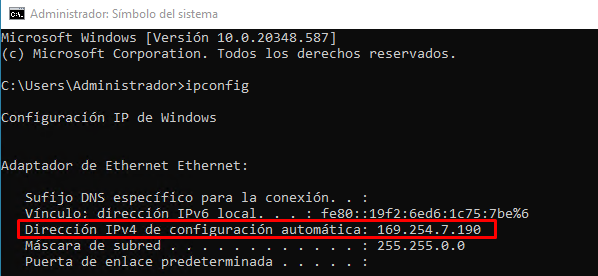
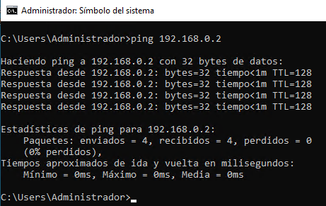

# Tarea 3: Interconexión y Gestión Avanzada

## Enunciado 1:

### Crear una nueva VM:

- Configurar una nueva VM con Windows Server 2022.
- Unirla al mismo segmento de red que la primera VM.
- Unir la nueva VM al dominio configurado en el AD del primer servidor.

## Procedimiento 1:

Usando la misma lógica de instalación que se empleó para instalar Windows Server 2019 en una máquina virtual empleando Hyper-v, se aplicará para configurar una nueva máquina virtual usando ahora Windows Server 2022.

A continuación se puede observar el resumen de la máquina que se creará:

Para los requisitos de la memoria RAM, almacenamiento, etc. Me base en las especificaciones publicadas en la página de Microsoft :

Además aclarar que la configuración del adaptador de red se encuentra en LAN (Red privada) como se puede observar en la siguiente imagen:

Se elige la experiencia de escritorio para una mayor facilidad:

Cómo creamos un servidor desde 0 elegimos la siguiente opción:

Almacenamiento designado:

Teniendo en cuenta las siguientes credenciales:

usuario: administrador

contraseña: Tomy@dev20

Ahora lo que realizaré será unir el servidor (Windows Server 2022) al mismo segmento de red al cual pertenece el servidor principal (Windows Server 2019):

Por lo tanto, primero voy a chequear la dirección IP que tiene configurada (segmento de red al cual pertenece) el servidor (Windows Server 2022):

Segundo chequeamos el Windows Server 2019 (servidor principal) la dirección IP que tiene configurada (segmento de red al cual pertenece):

Es decir, el servidor (Windows Server 2022) pertenece a otra red diferente a la cual tiene configurada nuestro servidor principal (Windows Server 2019). Por lo tanto, debemos en primera instancia configurar dicha dirección IP y que la misma pertenezca al mismo segmento de red en cual se encuentra el servidor principal.

De esta manera le configuramos la dirección IPV4 privada 192.168.0.4/24 donde lo interesante a destacar aquí es que el servidor DNS que le vamos a configurar es la dirección IP del servidor principal (Windows Server 2019) porque dicho servidor es el que se va a encargar de dicho servicio. Es decir, de la resolución de nombres de dominio.

Ahora volvemos a chequear y ya está realizada la configuración de dicha dirección IP:

Ahora realizamos un ping a la dirección IP que tiene configurada el servidor principal desde el servidor (Windows Server 2022) y observamos que todos los paquetes fueron enviados sin ninguna pérdida. Como se puede observar en la siguiente imagen:

Una vez realizado lo anterior voy a proseguir con unir la nueva VM (Windows Server 2022) al dominio configurado en el AD del primer servidor (Windows Server 2019):

Primero voy a cambiar el nombre que tiene asociado el equipo a uno que sea más fácil de recordar. También voy a modificar el nombre de dominio ¿Por cual? Por el que cree anteriormente. Por lo tanto:

Observamos que nos pide para realizar dicha acción: el nombre y la contraseña de una cuenta que posea estos permisos para unir al dominio. Por lo tanto, aquí vamos a usar las credenciales del administrador (cuenta principal) :

usuario: admin1

pass: Firefox_15

De esta manera el equipo WS2022 se ha unido correctamente al dominio EmpresaDev.local. Ahora lo que queda es reiniciar el equipo y volver a ingresar con las credenciales correspondientes.

Ahora si ingresamos \\\\192.168.0.2 (ip del servidor) podemos observar las siguientes carpetas compartidas que hacen parte del dominio:

Observamos que nos pide para realizar dicha acción: el nombre y la contraseña de una cuenta que posea estos permisos, hay que recordar que inicie sesión con la cuenta local configurada por default en Windows Server 2022 y NO con una de las cuentas del dominio en cuestión previamente configurados en el Windows Server 2019, es por ello que aparece tal advertencia. Por lo tanto, aquí vamos a usar las credenciales del administrador (cuenta principal):

Desde el servidor principal (Windows Server 2019) podemos chequear el servidor que se ha configurado en este apartado (Windows Server 2022) y que ya forma parte del dominio:

## Enunciado 2:

- Acceso al sitio web:

    - Desde la VM con Windows Server 2022, acceder al sitio estático "Hola Mundo" alojado en la VM con Windows Server 2019.

## Procedimiento 2:

Situados en la máquina virtual con Windows Server 2022 nos dirigimos al navegador web e ingresamos la dirección IP del servidor principal (Windows Server 2019) donde podemos observar dicho sitio web alojado en el mismo:

Ahora si ingresamos directamente el dominio (el cual fue creado previamente) en el navegador desde la misma máquina virtual con Windows Server 2022 ¿Que pasa? Aparece también dicho sitio web ¿Por qué? Porque el servidor principal (Windows Server 2019) realiza la traducción o resolución del nombre de dominio a dirección IP.

## Enunciado 3:

- Carpeta compartida y permisos:

    - Crear una carpeta compartida en la VM con Windows Server 2022.

    - Configurar permisos diferenciados para los tres usuarios creados en el AD:

        - Administrador: Permiso total (lectura, escritura y eliminación).

        - Técnico: Permiso de lectura y escritura, sin posibilidad de eliminar archivos.

        - Estándar: Permiso de solo lectura.

## Procedimiento 3:

Lo primero que se hará es crear una nueva carpeta en la ubicación en el disco local C e ir a la opción de “uso compartido avanzado”.

En los permisos del recurso compartido en este caso “Carpeta Compartida” se elimina el grupo “Todos”:

Ahora si se agregarán los tres usuarios que han sido creados previamente desde el AD en el Windows Server 2019 con sus permisos correspondientes para tal carpeta compartida:

Usuario administrador cuya información era:

Con los siguientes permisos para tal usuario:

Usuario técnico cuya información era:

Con los siguientes permisos para tal usuario:

Usuario Estándar cuya información era:

Con los siguientes permisos para tal usuario:

Ahora hay que configurar los permisos en la pestaña “seguridad” para tal carpeta compartida y agregar los 3 usuarios previamente mencionados siguiendo la siguiente lógica:

Agregamos el usuario administrador (Tomás Liendo)

Con los siguientes permisos:

Se emplea la misma lógica mencionada antes para agregar el usuario técnico (Juan Liendo) y el usuario estándar (Arturo Liendo). Donde el resultado final es el siguiente:

## Enunciado 4:

- Simulación de permisos:

    - Desde la VM con Windows Server 2019, conectarse a la carpeta compartida utilizando los tres usuarios y simular sus permisos sobre un archivo.

    - Documentar el comportamiento esperado de cada usuario según sus permisos.

## Procedimiento 4:

Con el usuario administrador agregamos dicha carpeta compartida:

Especificando la ruta correspondiente para acceder a dicha carpeta compartida:

Finalmente desde el usuario administrador accedimos a tal carpeta compartida:

Ahora realizo las siguientes acciones:

1\_ Creo una carpeta y un archivo de texto con el usuario admin1

2\_ Escribo algún tipo de texto en tal archivo de “códigos” y guardo tal información:

3\_ Por último borro un archivo de texto, el cual fue previamente creado desde Windows Server 2022:

Teniendo como resultado dicho archivo eliminado:

Ahora voy a ingresar con el usuario técnico al Windows Server 2019, donde debido a que iniciamos sesión por primera vez con tal usuario se va actualizar la contraseña para tal usuario. Quedando como credenciales actualizadas para el mismo:

usuario: tecnico1

pass: Firefox_16

Pero con el usuario técnico ya logueado agregamos dicha carpeta compartida:

Y de esta manera pudimos acceder a la carpeta compartida:

Ahora realizo las siguientes acciones:

1\_ Creo un archivo de texto “Informe para técnicos” con el usuario tecnico1:

2\_ Escribo algún tipo de texto en tal archivo de “códigos” y guardo tal información:

3\_ Por último borro un archivo de texto, el cual fue previamente creado por el usuario admin1 “Tomas Liendo” que posee todos los privilegios para esta carpeta compartida:

¿Qué sucede? Lo que ya veníamos esperando, a este usuario “tecnico1” como previamente le configuramos para esta carpeta compartida los permisos de lectura y escritura, sin posibilidad de eliminar archivos. Ahora no lo está dejando eliminar tales archivos lo cual es correcto y que dichos permisos están actuando de forma correcta:

Ahora voy a ingresar con el usuario estándar al Windows Server 2019 donde las credenciales del mismo son:

usuario: estandar1

pass: Firefox_17

Recodar que el usuario administrador principal de todos es:

usuario:administrador

pass: Tomy@dev10

Por lo tanto con el usuario estandar1 agregamos dicha carpeta compartida:

Y de esta manera pudimos acceder a la carpeta compartida:

Ahora realizo las siguientes acciones:

Intento crear un archivo de texto llamado “Informe para usuarios estándares” con el usuario estandar1 pero no puedo hacerlo debido a que este usuario “estandar1” como previamente le configuramos para esta carpeta compartida solo los permisos de lectura y sin posibilidad de escritura ni tampoco de eliminar archivos. Ahora no lo está dejando crear y tampoco eliminar archivos lo cual es correcto y refleja que dichos permisos están actuando de forma correcta:

